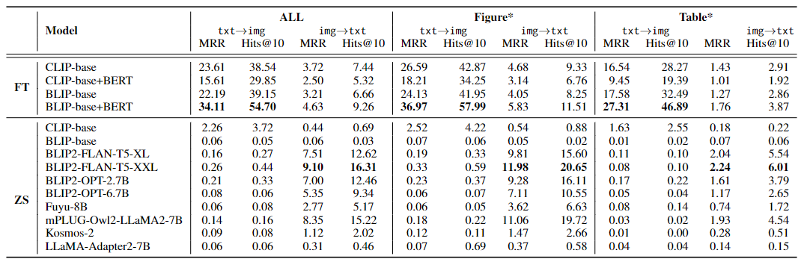

## SciMMIR

This is the repo for the paper [SciMMIR： Benchmarking Scientific Multi-modal Information Retrieval](https://zenodo.org/records/10521030/files/SciMMIR__Benchmarking_Scientific_Multimodal_Information_Retrieval.pdf?download=1).

<div align="center">

</div>

In this paper, we propose a novel SciMMIR benchmark and a corresponding dataset designed to address the gap in evaluating multi-modal information retrieval (MMIR) models in the scientific domain.

It is worth mentioning that we define a data hierarchical architecture of "Two subsets, Five subcategories" and use human-created keywords to classify the data (as shown in the table below).

<div align="center">

</div>

As shown in the table below, we conducted extensive baselines (both fine-tuning and zero-shot) within various subsets and subcategories.



For more detailed experimental results and analysis, please refer to our paper [SciMMIR](https://zenodo.org/records/10521030/files/SciMMIR__Benchmarking_Scientific_Multimodal_Information_Retrieval.pdf?download=1).

## Dataset & Codes

Our SciMMIR benchmark dataset used in this paper contains 537K scientific image-text pairs which are extracted from the latest 6 months' papers in Arxiv (2023.05 to 2023.10), and we will continue to expand this data by extracting data from more papers in Arxiv and provide larger versions of the dataset.

The datasets can be obtained from huggingface Datasets [m-a-p/SciMMIR](https://huggingface.co/datasets/m-a-p/SciMMIR), and the following codes show how to use it:

```python
import datasets
ds_remote = datasets.load_dataset("m-a-p/SciMMIR")
test_data = ds_remote['test']
caption = test_data[0]['text']
image_type = test_data[0]['class']
image = test_data[0]['image']
```

We will release the codes soon...

## Citation

```
@misc{wu2024scimmir,
  author       = {Wu, Siwei and
                  LI, Yizhi and
                  Zhu, Kang and
                  Zhang, Ge and
                  Liang, Yiming and
                  Ma, Kaijing and
                  Xiao, Chenghao and
                  Zhang, Haoran and
                  Yang, Bohao and
                  Chen, Wenhu and
                  Huang, Wenhao and
                  Moubayed, Noura Al and
                  Fu, Jie and
                  Lin, Chenghua},
  title        = {{SciMMIR: Benchmarking Scientific Multi-modal 
                   Information Retrieval}},
  month        = jan,
  year         = 2024,
  publisher    = {Zenodo},
  doi          = {10.5281/zenodo.10521030},
  url          = {https://doi.org/10.5281/zenodo.10521030}
}
```

