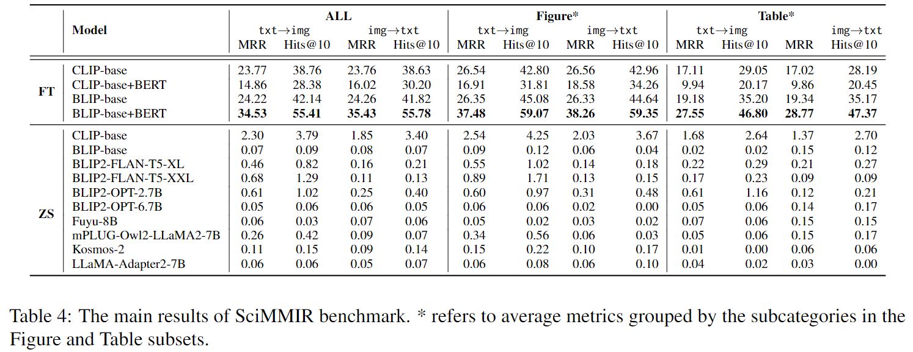

## SciMMIR

This is the repo for the paper [SciMMIR：Benchmarking Scientific Multi-modal Information Retrieval]().

In this paper, we propose a novel SciMMIR benchmark and a corresponding dataset designed to address the gap in evaluating multi-modal information retrieval (MMIR) models in the scientific domain.

It is worth metion that we define a data hierarchical architecture of "Two subsets, Five subcategories" and a use the human created key words to classify the data (as shown in the table below).

As shown in the table below, we conducted extensive baselines (both fine-tuning and zero-shot) within various subsets and subcategories.

For more detailed experimental results and analysis, please refer to our paper [SciMMIR]().

## Dataset & Codes

Our SciMMIR benchmark dataset used in this paper contain 537K scientific image-text paris which are extracted from the latest 6 months' papers in Arxiv (2023.05 to 2023.10), and we will continue to expand this data by extracting data from more papers in Arxiv and provide larger versions of the dataset.

We will relase the Dataset and codes soonly ...
